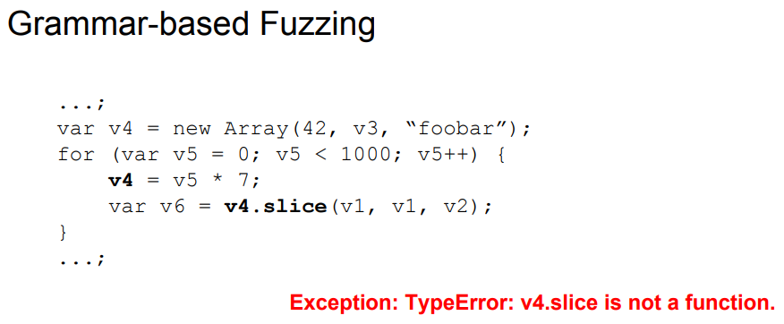

## 들어가며

안녕하세요. 

이번 글에서는 자바스크립트 엔진을 대상으로 하는 취약점 탐지, 그 중에서도 **퍼징**에 대한 최신 연구동향을 
간단히 살펴보도록 하겠습니다.(이쪽을 처음 보시는 분들께 적합한 내용입니다.)

## 자바스크립트 엔진

먼저 자바스크립트 엔진 구조에 대해서 간단히 살펴보겠습니다.

 

출처 Attacking Client Side JIT Compilers(Blackhat USA 2018) 

자바스크립트 엔진은 크게 위와 같은 구조로 되어있습니다. 각 부분별 개념적인 기능은 다음과 같습니다.

### Parser
자바스크립트 코드를 입력으로 받아 구문별로 파싱을 한 뒤 _bytecode_를 생성합니다.

### Interpreter
_bytecode_를 받아 실제 머신에서 코드를 실행시킵니다.

### JIT Compiler
_bytecode_를 Interpreter를 통해 실행할 경우 속도가 느린 단점이 있습니다. 
따라서 자주 사용되는 코드의 경우 _bytecode_를 JIT Compiler를 통해 _최적화된 머신 코드_로 만듭니다.

### Runtime
코드가 실행될 때 사용하는 내장 함수나 객체 등을 가지고 있습니다.

### Garbage Collector
사용되지 않는 객체 등 불필요한 메모리를 해제합니다. 

 

## 자바스크립트 엔진 대상 퍼징 전략
지금부터는 자바스크립트 엔진을 대상으로 하는 퍼징 연구는 어떤 것들이 있는지 살펴보겠습니다.

### 코드생성(Grammar-based generation) 퍼징
코드생성(Grammar-based generation) 퍼징이란 먼저 자바스크립트 문법을 정의하고 거기에 맞는 자바스크립트 코드를 
임의로 생성하도록해서 퍼징을 수행하는 방법입니다. 대표적인 것이 jsfunfuzz, Domato인데요, 정의된 문법을 따라 코드를 생성하였기에 문법적으론 오류가 발생하지 않습니다. 하지만 문법만 맞지 코드상의 의미(Semantics)가 맞지 않는 경우가 많아 런타임 오류가 발생하는 문제가 있습니다.

 
	
출처 Fuzzilli-Guided fuzzing for Javascript Engines(OffensiveCon 2019) 

자바스크립트는 타입이 엄격한 언어가 아니기 때문에 위의 예처럼 문법적으론 문제가 없으나 실행시에는 *v4* 변수의 타입에는 *slice* 함수를 제공하고 있지 않아 오류가 발생하게 됩니다. 따라서 그 이후의 코드는 실행이 되지 않습니다. 나중에 간단히 살펴볼 CodeAlchemist 논문에서도 이러한 런타임 오류 때문에 문법규칙만을 따라 생성된 자바스크립트 코드의 대부분이 첫 3~4줄 정도만 실행되는 것을 확인했다고 합니다(또한 실제로 생성된 코드에서 문법 오류도 많이 발생했다고 하는데 이는 매뉴얼로 문법 규칙을 정의하는데서 오는 것이라고 합니다).       

그래서 이런 런타임 오류 문제를 해결하기 위해 try catch 구문을 활용하게 되었습니다.

 

출처 Fuzzilli-Guided fuzzing for Javascript Engines(OffensiveCon 2019) 

이렇게 try catch 구문으로 감싸게 되면 런타임 오류가 발생하더라도 예외 구문으로 처리가 되면서 이후 코드들도 계속 실행시킬 수 있게 됩니다. 하지만 이런 경우는 JIT 컴파일러에서 try catch 구문을 사용한 코드와 안한 코드가 서로 다르게 처리되는 문제가 있다고 합니다.
 
따라서 이런 문제를 해결하고자 하는 연구가 지속적으로 진행중이며, 최근에 여러 좋은 연구들이 발표되고 있습니다.

그 중에서 대표적인 것으로 fuzzilli(코드 커버리지 guided)와 CodeAlchemist(semantic-aware)가 있습니다.
각 연구가 어떤 내용인지 간략히 살펴보겠습니다. 

### Fuzzilli

Pwn2Own을 여러번 우승한 Samuel Gross가 최근에 공개한 자바스크립트 엔진 대상 퍼저(Fuzzilli)입니다.
Fuzzilli의 목표는 코드 커버리지 Guided 퍼징 전략을 자바스크립트 엔진에 적용하는 것입니다. 

이를 위해선 앞서 살펴본 바와 같이 정의된 문법에 기초하여 생성된 자바스크립트 코드가 유의미하게(Semantic Correctness) 작성되어야 하는 조건이 있습니다. 이를 위해 Fuzzilli에서는 새로운 IL(Intermediate Language)을 
정의하고 이것을 Mutation 시키는 방법을 제안했습니다.

 

출처 Fuzzilli-Guided fuzzing for Javascript Engines(OffensiveCon 2019) 

이렇게 Mutation된 IL을 다시 자바스크립트 코드로 변환(Lifting)하여 퍼징을 수행하는 방식입니다.
코드 커버리지는 AFL처럼 생성한 자바스크립트 코드로 새로운 경로를 발견하게 되면 이를 기반 코드로 하여 다시 Mutation과 퍼징을 반복 수행하게 됩니다.

Fuzzilli의 전체적인 동작 방식은 아래 그림과 같습니다.

 

출처 Fuzzilli-Guided fuzzing for Javascript Engines(OffensiveCon 2019) 

Fuzzilli에서 추가적으로 눈길을 끈 점은 크래시가 나거나 새로운 경로를 발견한 경우 이를 한번 더 실행시켜보고 똑같은 결과가 나오는지 확인한다는 점(Determinism)과 항상 코드를 유의미하게 만들지는 않는다는 점(Complete semantic correctness is not desirable)입니다.  

Determinism을 적용한 것은 크래시의 발생이나 새로운 경로 발견시의 false positive(메모리 부족에 따른 오류 등)를 제거하기 위함이라고 하며, 항상 유의미한 코드를 만들지는 않는다는 것은 간혹 예상치 못한 exception에서 취약점이 나올 수도 있기 때문이라고 합니다.                                                                                                                                                                     

### CodeAlchemist

CodeAlchemist는 KAIST에서 NDSS 2019에 발표한 논문입니다. 이 논문 역시 생성된 자바스크립트 코드가 유의미하도록 만드는데 초점을 맞추고 있습니다. 

이를 위해서 논문에서는 자바스크립트 코드를 각각의 조각(Code Brick)로 나눠 각 조각 별로 조건(Pre-condition, Post-condition)을 분석합니다. 

 

출처 CodeAlchemist:Semantics-Aware Code Generation to Find Vulnerabilities in Javascript Engines(NDSS 2019)

여기서 Pre-condition은 코드 조각이 유의미하기 위해 필요한 조건(정의되어 있어야 하는 변수와 타입)을 의미하며, 
Post-condition은 해당 코드 조각이 실행된 이후 사용가능한 조건(정의되어 있는 변수와 타입)을 말합니다.
따라서 생성한 자바스크립트 코드가 유의미하기 위해서는 각 코드 조각들을 pre, post 조건에 맞춰 퍼즐 맞추듯이 코드를 생성해 내는 방법입니다.

 

출처 CodeAlchemist:Semantics-Aware Code Generation to Find Vulnerabilities in Javascript Engines(NDSS 2019)

## 향후 발전방향?!

지금까지 자바스크립트 엔진을 대상으로 하는 최신 퍼징 연구동향을 살펴보았습니다. 단순 자바스크립트 코드 생성(문법적으로 오류가 없는)을 넘어서 의미있는 코드 생성으로 흐름이 넘어가고 있고, 여기에 코드 커버리지까지 엮는 연구가 진행되고 있습니다. 

앞으로의 연구 진행 방향에 대해서 생각해보고 진행도 해보고 다른 연구자들의 결과들도 관심가지고 지켜보면 재미있을 것 같습니다. :)

